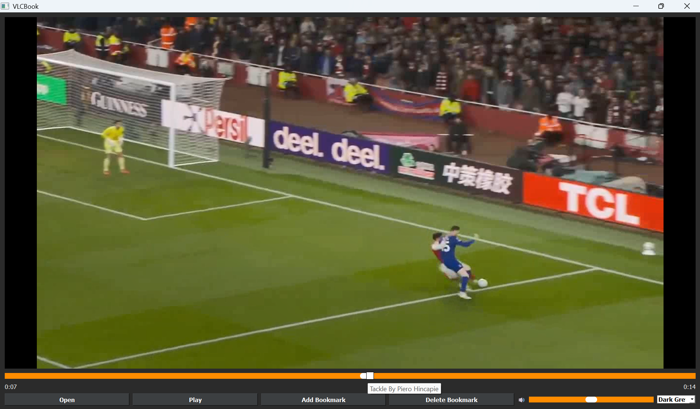
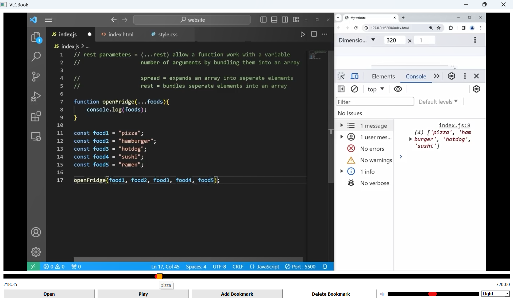

#VidMark 
A desktop video bookmark player built with Python and PyQt5.
Drop named bookmarks at any timestamp — they persist between sessions 
and appear as visual markers on the seekbar

- 🎥 Play videos (MP4, AVI, WMV and more)
- 🔖 Add named bookmarks at any timestamp
- 💾 Bookmarks persist between sessions
- 📍 Visual markers on seekbar showing bookmark positions
- 🖱️ Hover over markers to see bookmark label
- ⏩ Click a marker to jump to that timestamp
- 🎨 Theme switcher (Dark Grey, Pure Black, Light)
- ⏱️ Timestamp display

## How to Run

### Option 1 — Download the exe
Download VidMark.exe` from the releases page and run it directly. No installation needed.

### Option 2 — Run from source
1. Clone the repo
2. Install dependencies: `pip install PyQt5`
3. Run: `python main.py`

## Built With

- Python
- PyQt5

## Screenshots

